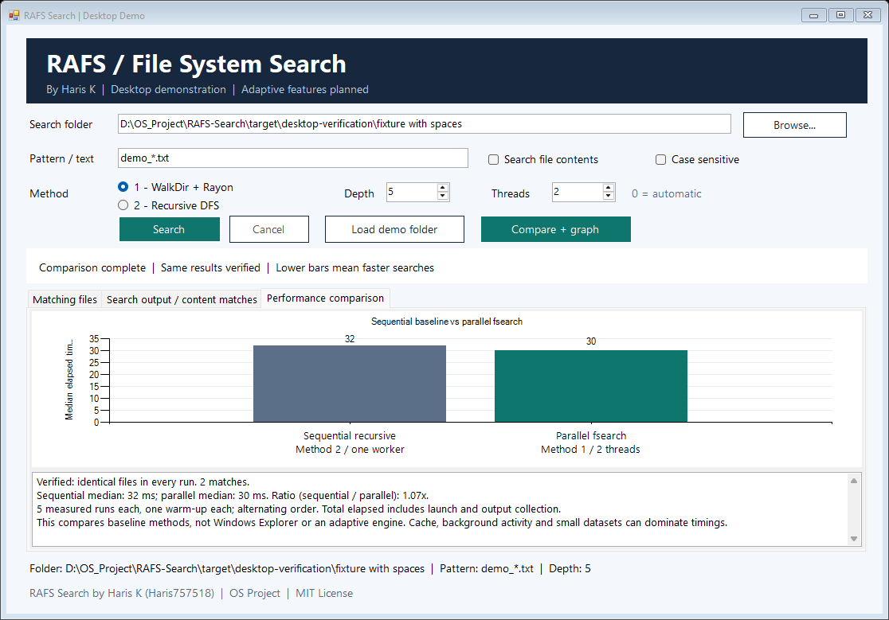

# RAFS Search

**Runtime-Adaptive File System Search Using Workload-Aware Traversal and Concurrency Selection**

OS project by **Haris K ([Haris757518](https://github.com/Haris757518))**.

The current implementation adds a Windows desktop demonstration and measured comparison graph around the original Rust fsearch engine. **Runtime-adaptive functionality is planned and has not yet been implemented.**

## Run the desktop app

Build once on Windows, then double-click `RAFS-Search.exe` in the project root:

```powershell
cargo build --release
.\desktop-app\build.ps1
```

The interface supports folder browsing, filename/content search, depth settings, original methods 1 and 2, fixed thread counts for method 1, cancellation, and CSV result export.

## Demonstrate the comparison graph

1. Choose an existing folder with enough files to produce meaningful timings.
2. Enter a filename pattern, for example `*.txt`, and choose depth and method-1 thread count.
3. Click **Compare + graph**.

The chart compares sequential recursive search (original method 2) with parallel fsearch (original method 1) on the same workload. Each method receives one warm-up and five measured runs, with alternating order. Every run must return the same file paths before a chart is shown. Graph values are median total elapsed milliseconds, including process launch and output collection. Lower is better; either method may win.



The screenshot shows a real small-fixture test; your results will depend on the folder and workload you choose.

This is not a comparison against Windows Explorer, indexed search, or an adaptive engine. Cache state, background activity and process-launch overhead influence results. Filename/content matching settings are held constant. Content-result path sets are compared; matching line text is not compared by the benchmark.

## Project ownership and upstream attribution

- RAFS desktop interface, comparison demonstration, and project documentation: **Haris K / Haris757518**.
- Reused-engine provenance and original author credit: see [AUTHORS.md](AUTHORS.md) and [LICENSE](LICENSE).
- Original baseline commit: `e74d9d5b72662a23f7ae8a0dde527be3d2517365`.
- Original MIT LICENSE, author credits, Rust package names, and full Git history are retained.
- `master` preserves the original baseline; `rafs-development` contains the RAFS additions.

The original documentation is retained in [UPSTREAM_README.md](UPSTREAM_README.md). See [BASELINE_NOTES.md](BASELINE_NOTES.md) for baseline inspection and [desktop-app/README.md](desktop-app/README.md) for app instructions.
